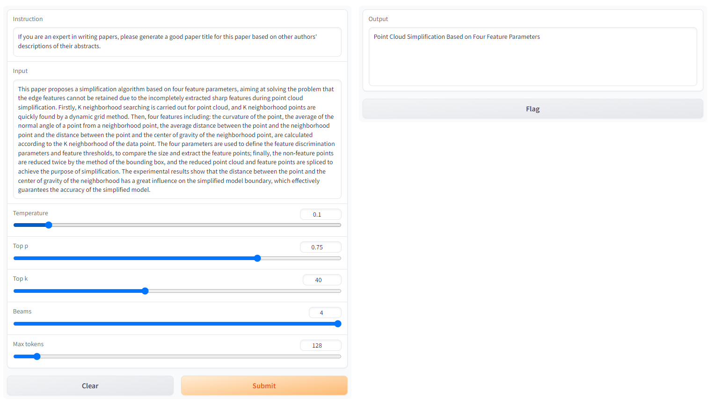

  

  

    <h3>ChatGenTitle: xxx</h3>
    

      
      
      
      
      
  

# Release

|模型名称|微调数据量|微调基准模型|微调效果|
|:-|:-|:-|:-|
|LLaMa-Lora-7B-50-3|50w|LLaMa-7B||

> 所有模型在*4×A100 (80GB)*完成训练

# Usage

[使用教程](https://github.com/WangRongsheng/ChatGenTitle/blob/main/docs/Command/alpaca-lora.md)

# Reference

- [stanford_alpaca](https://github.com/tatsu-lab/stanford_alpaca)
- [alpaca-lora](https://github.com/tloen/alpaca-lora)

> Instruct微调和LoRa微调是两种不同的技术。
> Instruct微调是指在深度神经网络训练过程中调整模型参数的过程，以优化模型的性能。在微调过程中，使用一个预先训练好的模型作为基础模型，然后在新的数据集上对该模型进行微调。**Instruct微调是一种通过更新预训练模型的所有参数来完成的微调方法，通过微调使其适用于多个下游应用。**
> LoRa微调则是指对低功耗广域网（LoRaWAN）中的LoRa节点参数进行微调的过程，以提高节点的传输效率。**在LoRa微调中，需要了解节点的硬件和网络部署情况，并通过对节点参数进行微小调整来优化传输效率。与Instruct微调相比，LoRA在每个Transformer块中注入可训练层，因为不需要为大多数模型权重计算梯度，大大减少了需要训练参数的数量并且降低了GPU内存的要求。**

> **研究发现，使用LoRA进行的微调质量与全模型微调相当，速度更快并且需要更少的计算。因此，如果有低延迟和低内存需求的情况，建议使用LoRA微调。**

# Resources

- [ChatDoctor](https://github.com/Kent0n-Li/ChatDoctor)
- [Chinese-alpaca-lora](https://github.com/LC1332/Chinese-alpaca-lora)

# LICENSE

This work is licensed under a
[Creative Commons Attribution-NonCommercial-ShareAlike 4.0 International License][cc-by-nc-sa].

[![CC BY-NC-SA 4.0][cc-by-nc-sa-image]][cc-by-nc-sa]

[cc-by-nc-sa]: http://creativecommons.org/licenses/by-nc-sa/4.0/
[cc-by-nc-sa-image]: https://licensebuttons.net/l/by-nc-sa/4.0/88x31.png
[cc-by-nc-sa-shield]: https://img.shields.io/badge/License-CC%20BY--NC--SA%204.0-lightgrey.svg
