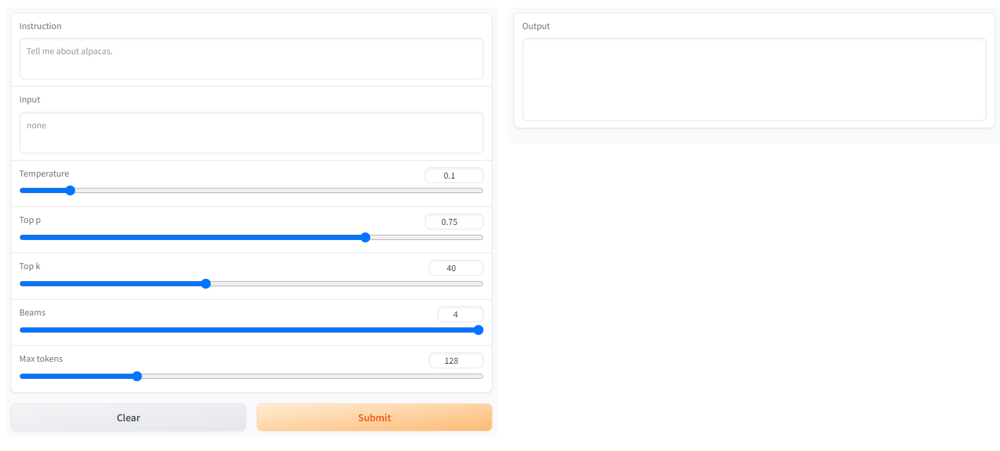
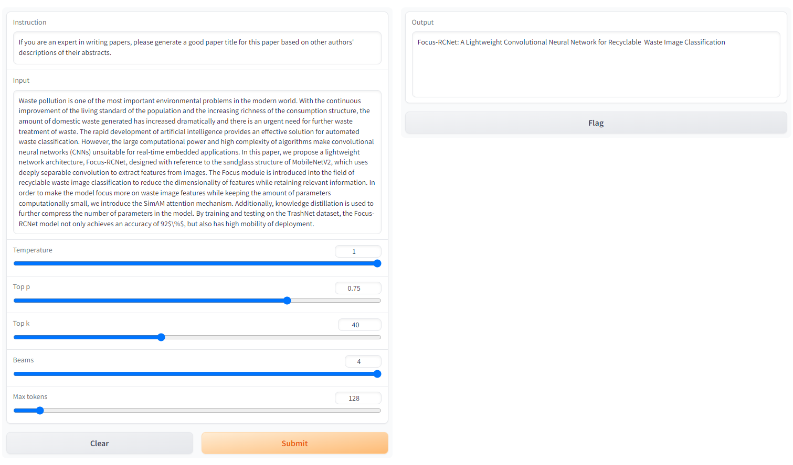

**项目名称**：ChatGenTitle：使用百万arXiv论文信息在LLaMA模型上进行微调的论文题目生成模型

**开源地址**：https://github.com/WangRongsheng/ChatGenTitle

## 项目背景

科研论文写作中，生成一个有吸引力的、准确的论文标题需要综合考虑多个因素，这是论文作者面临的一个重要挑战。生成一个论文标题的难点有：

1. 简洁但准确：一个好的论文标题应该简洁、精炼，但同时又能准确地反映出论文研究的重点和核心所在，这对于作者来说是一个巨大的挑战。
2. 独特但易于理解：论文题目应该是独特的，能够吸引读者的兴趣，但同时也要易于理解，避免过于笼统或过于繁琐深奥的词汇。
3. 体现研究的贡献：好的论文题目应该能够明确体现出研究的贡献，突出研究创新点，使读者对该研究的贡献显而易见。
4. 避免使用口头禅：一些常用的词汇、短语等可能被过多的使用，这样会使得论文的题目显得陈旧、无创新性，甚至会让人感到毫无意义。

最近，以ChatGPT、GPT-4等为代表的大语言模型（Large Language Model, LLM）掀起了新一轮自然语言处理领域的研究浪潮，展现出了类通用人工智能（AGI）的能力，受到业界广泛关注。在这些工作以外，许多学者开始关注以低成本实现个人"ChatGPT"的方案，如：stanford_alpaca[1]、alpaca-lora[2]，这些方案聚焦于大模型微调，然而我们更期望探索大模型在下游任务的落地。

为此，我们关注到论文题目生成领域，ArXiv（全称为：The arXiv.org e-Print archive）是一个由康奈尔大学创建和维护的一个免费、开放的学术预印本社区，它于1991年创立。ArXiv是全球数学、物理学等学科的电子预印本和会议论文库，包含了众多的高质量学术论文和研究报告，覆盖面日益增广。arXiv中包含了众多高质量的论文元信息。通过arXiv上开放的论文信息，我们构建了一个包含220万篇论文元信息的数据库。这些数据通过数据清洗等被构建成了可以用于大模型微调的数据对。

将这些论文元信息引入大模型微调，它可以对生成论文题目涉及的难点产生积极影响，它可以从以下几个方面提供帮助：

1. 提供更准确、广泛的语言模型：大模型通常使用了大量数据进行训练，因此其语言模型可以更准确地解释自然语言，能够应对更多的语言场景，提升论文题目的语言表达能力。
2. 提供更加精准的语义理解：大模型采用了深度学习的技术手段，能够构建语言的高维向量表示，从而提供更准确的语义理解能力，帮助生成更精确、准确的论文题目。
3. 增强创造性和创新性：大模型使用了大量的训练数据，并能够从数据中提取规律，从而提供更多的词汇或句子组合方式，增强了生成论文题目的创造性和创新性。
4. 提高效率：相比传统的手动方式，使用大模型来生成论文题目可以极大地提高效率，不仅减少了需要写出标题的时间，同时也不容易产生显著的错误，提高了输出的质量。

总之，引入大模型可以提供更好的帮助来解决生成论文题目的难点，有望提升分析、抽象、创新等能力。

## arXiv数据集介绍

我们所搜集的论文元信息包含全部的学科分类，如：

1. 计算机科学（Computer Science）
2. 数学（Mathematics）
3. 物理学（Physics）
4. 统计学（Statistics）
5. 电气工程和系统科学（Electrical Engineering and Systems Science）
6. 经济学（Economics）
7. 量子物理（Quantum Physics）
8. 材料科学（Materials Science）
9. 生物学（Biology）
10. 量化金融（Quantitative Finance）
11. 信息科学（Information Science）
12. 交叉学科（Interdisciplinary）。

每个大类下面还有很多具体的子类，如计算机科学大类下又包括计算机视觉、机器学习、人工智能、计算机网络等子类。如果您想找到特定领域的论文，可以根据这些分类进行选择。

每一篇论文都包含如下字段的元信息：
```json
{
	"id":string"0704.0001",
	"submitter":string"Pavel Nadolsky",
	"authors":string"C. Bal\'azs, E. L. Berger, P. M. Nadolsky, C.-P. Yuan",
	"title":string"Calculation of prompt diphoton production cross sections at Tevatron and LHC energies",
	"comments":string"37 pages, 15 figures; published version",
	"journal-ref":string"Phys.Rev.D76:013009,2007",
	"doi":string"10.1103/PhysRevD.76.013009",
	"report-no":string"ANL-HEP-PR-07-12",
	"categories":string"hep-ph",
	"license":NULL,
	"abstract":string" A fully differential calculation in perturbative quantum chromodynamics is presented for the production of massive photon pairs at hadron colliders. All next-to-leading order perturbative contributions from quark-antiquark, gluon-(anti)quark, and gluon-gluon subprocesses are included, as well as all-orders resummation of initial-state gluon radiation valid at next-to-next-to-leading logarithmic accuracy. The region of phase space is specified in which the calculation is most reliable. Good agreement is demonstrated with data from the Fermilab Tevatron, and predictions are made for more detailed tests with CDF and DO data. Predictions are shown for distributions of diphoton pairs produced at the energy of the Large Hadron Collider (LHC). Distributions of the diphoton pairs from the decay of a Higgs boson are contrasted with those produced from QCD processes at the LHC, showing that enhanced sensitivity to the signal can be obtained with judicious selection of events. ",
	"versions": 
}
```

- id: ArXiv ID (can be used to access the paper, see below)
- submitter: Who submitted the paper
- authors: Authors of the paper
- title: Title of the paper
- comments: Additional info, such as number of pages and figures
- journal-ref: Information about the journal the paper was published in
- doi: [https://www.doi.org](Digital Object Identifier)
- abstract: The abstract of the paper
- categories: Categories / tags in the ArXiv system
- versions: A version history

## LLMs微调

ChatGenTitle基于Meta的LLaMA模型进行微调，微调主流的方法有：Instruct微调和LoRa微调。

Instruct微调和LoRa微调是两种不同的技术。Instruct微调是指在深度神经网络训练过程中调整模型参数的过程，以优化模型的性能。在微调过程中，使用一个预先训练好的模型作为基础模型，然后在新的数据集上对该模型进行微调。Instruct微调是一种通过更新预训练模型的所有参数来完成的微调方法，通过微调使其适用于多个下游应用。LoRa微调则是指对低功耗广域网（LoRaWAN）中的LoRa节点参数进行微调的过程，以提高节点的传输效率。在LoRa微调中，需要了解节点的硬件和网络部署情况，并通过对节点参数进行微小调整来优化传输效率。与Instruct微调相比，LoRA在每个Transformer块中注入可训练层，因为不需要为大多数模型权重计算梯度，大大减少了需要训练参数的数量并且降低了GPU内存的要求。 研究发现，使用LoRA进行的微调质量与全模型微调相当，速度更快并且需要更少的计算。因此，如果有低延迟和低内存需求的情况，建议使用LoRA微调。

因此我们选择使用LoRA微调构建整个ChatGenTitle。

```python
# 下载项目
git clone https://github.com/tloen/alpaca-lora.git

# 安装依赖
pip install -r requirements.txt

# 转化模型
python src/transformers/models/llama/convert_llama_weights_to_hf.py \
    --input_dir ../model/ \
    --model_size 7B \
    --output_dir ../model/7B-hf
	
# 单机单卡训练模型
python finetune.py \
    --base_model '../model/7B-hf' \
    --data_path '../train.json' \
    --output_dir '../alpaca-lora-output'

# 单机多卡(4*A100)训练模型
WORLD_SIZE=4 CUDA_VISIBLE_DEVICES=0,1,2,3 torchrun --nproc_per_node=4 --master_port=3192 finetune.py \
    --base_model '../model/7B-hf' \
    --data_path '../train.json' \
    --output_dir '../alpaca-lora-output' \
    --batch_size 1024 \
    --micro_batch_size 128 \
	--num_epochs 3
```

## 在线访问

在开始部署使用之前，我们需要知道两个模型的定义。整个项目会有LLaMA和LoRA两种模型，LoRA模型是我们微调产生保存的权重，LLaMA 权重则是由Meta公司开源的大模型预训练权重。我们可以将生成的LoRA权重认为是一个原来LLaMA模型的补丁权重。因此我们要同时加载两种不同模型。目前我们已经提供的LoRA模型有：

|模型名称|微调数据|微调基准模型|模型大小|微调时长|
|:-|:-|:-|:-|:-|
|LLaMa-Lora-7B-3|arXiv-50-all|LLaMa-7B|148.1MB|9 hours|
|LLaMa-Lora-7B-3-new |arXiv-50-all|LLaMa-7B|586MB|12.5 hours|
|LLaMa-Lora-13B-3|arXiv-100-all|LLaMa-13B|230.05MB|26 hours|

> 更多模型将会很快发布！

准备好需要的两种权重，就可以开启使用：
```python
# 推理
python generate.py \
    --load_8bit \
    --base_model '../model/7B-hf' \
    --lora_weights '../alpaca-lora-output'
```

当模型运行以后，访问`127.0.0.1:7860`即可。



然后在`Instruction`中输入：
```python
If you are an expert in writing papers, please generate a good paper title for this paper based on other authors' descriptions of their abstracts.
```

在`Input`中输入：
```python
<你论文的摘要>：Waste pollution is one of the most important environmental problems in the modern world. With the continuous improvement of the living standard of the population and the increasing richness of the consumption structure, the amount of domestic waste generated has increased dramatically and there is an urgent need for further waste treatment of waste. The rapid development of artificial intelligence provides an effective solution for automated waste classification. However, the large computational power and high complexity of algorithms make convolutional neural networks (CNNs) unsuitable for real-time embedded applications. In this paper, we propose a lightweight network architecture, Focus-RCNet, designed with reference to the sandglass structure of MobileNetV2, which uses deeply separable convolution to extract features from images. The Focus module is introduced into the field of recyclable waste image classification to reduce the dimensionality of features while retaining relevant information. In order to make the model focus more on waste image features while keeping the amount of parameters computationally small, we introduce the SimAM attention mechanism. Additionally, knowledge distillation is used to further compress the number of parameters in the model. By training and testing on the TrashNet dataset, the Focus-RCNet model not only achieves an accuracy of 92%, but also has high mobility of deployment.
```

点击`Submit`等待即可！



`Output`输出即为ChatGenTitle为你生成的论文题目。

## 参考

[1] https://github.com/tatsu-lab/stanford_alpaca
[2] https://github.com/tloen/alpaca-lora